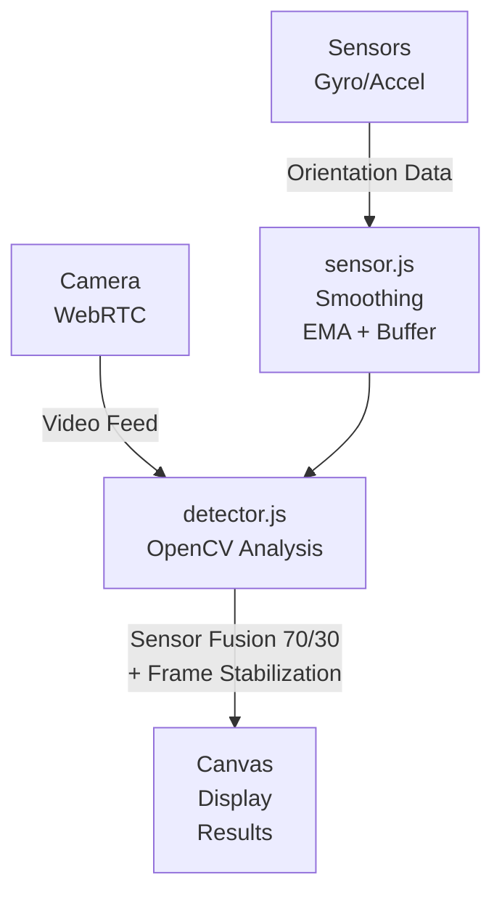

# Frame Checker - Picture Frame Alignment Detector

A real-time web application that uses your camera and device sensors to detect picture frames on walls and shows whether they're perfectly vertical or tilted.

**🆕 NEW**: Now with sensor fusion! Uses device gyroscope/accelerometer for enhanced accuracy and stability.

📖 **[Quick Start Guide](QUICK_START.md)** | 🔬 **[Sensor Test Page](sensor-test.html)** | 📝 **[Implementation Notes](IMPLEMENTATION_NOTES.md)**

## Features

- 🎥 **Multi-Camera Support** - Select from all available cameras
- 🔍 **Real-Time Detection** - Instant frame detection and analysis
- � **Sensor Fusion** - Uses device gyroscope/accelerometer for enhanced accuracy (if available)
- 📐 **Tilt Analysis** - Shows exact tilt angle and direction
- 🎨 **Visual Feedback**:
  - **GREEN**: Perfectly vertical (±2°)
  - **YELLOW**: Slightly tilted (2°-5°)
  - **RED**: Significantly tilted (>5°)
- ⚙️ **Adjustable Sensitivity** - Fine-tune detection for different environments- 🎚️ **Adjustable Smoothing** - Control stability vs responsiveness of measurements
- 📷 **Snapshot Capture** - Save images with tilt measurements and annotations- 🎯 **Stabilized Readings** - Hand shake doesn't affect measurements

## How It Works

The app uses multiple technologies for accurate tilt detection:
- **WebRTC** for camera access
- **OpenCV.js** for computer vision
- **Device Orientation API** for gyroscope/accelerometer data (when available)
- **Sensor Fusion** - Combines camera and sensor data for stability
- Edge detection (Canny algorithm)
- Contour detection to find rectangular frames
- Angle calculation to determine tilt
- Multi-stage smoothing to eliminate hand shake

### Sensor Fusion Technology

When supported by your device, the app uses a sophisticated sensor fusion algorithm:
1. **Device Sensors** - Accelerometer/gyroscope provides real-time device orientation
2. **Camera Detection** - Computer vision detects wall features and frame angles
3. **Adaptive Smoothing** - Multiple smoothing stages (EMA, rolling average, deadband)
4. **Stability Tracking** - Assumes frames don't move, averages measurements over time
5. **Hand Shake Compensation** - Your hand movements are filtered out automatically

This results in stable, accurate tilt measurements even when holding the camera by hand.

### Anti-Shake Technology

The app employs multiple techniques to ensure stable readings despite hand movement:

1. **Multi-Stage Sensor Smoothing**:
   - Rolling average buffer (10 readings)
   - Exponential moving average (EMA)
   - Deadband filtering (0.5° threshold)

2. **Frame Stability Tracking**:
   - Assumes frames on walls are static
   - Maintains measurement history for each detected frame
   - Weighted average prioritizing recent measurements
   - Up to 10 measurements averaged per frame

3. **Sensor-Camera Fusion**:
   - Device sensors (70%) - Reliable for device orientation
   - Camera detection (30%) - Good for environmental features
   - Combined for best accuracy

4. **Intelligent Compensation**:
   - Environmental vertical detection (walls, doors)
   - Automatic camera tilt correction
   - Perspective-aware angle calculation

The result: You can point your camera at a frame with slightly shaky hands and get a stable, accurate reading of whether the frame is tilted or not.

## Getting Started

### Prerequisites

- A modern web browser (Chrome, Edge, Firefox, or Safari)
- A camera (webcam or phone camera)
- A local web server

### Installation

1. Ensure you're in the FrameChecker directory:
   ```
   cd C:\TEMP\FrameChecker
   ```

2. Start a local web server using one of these methods:

   **Option A: Using Python**
   ```bash
   # Python 3
   python -m http.server 8000
   
   # Python 2
   python -m SimpleHTTPServer 8000
   ```

   **Option B: Using Node.js (http-server)**
   ```bash
   # Install http-server globally (one time)
   npm install -g http-server
   
   # Run server
   http-server -p 8000
   ```

   **Option C: Using PowerShell (Windows)**
   ```powershell
   # Run the included server script
   .\server.ps1
   ```

   **Option D: Using VS Code Live Server Extension**
   - Install "Live Server" extension in VS Code
   - Right-click on `index.html` and select "Open with Live Server"

3. Open your browser and navigate to:
   ```
   http://localhost:8000
   ```

4. Grant camera permissions when prompted

### Usage

1. Click **"Start Camera"** to begin
2. **On iPhone/Mobile**: 
   - Check "Use Back Camera" to use the rear camera (recommended for wall frames)
   - If prompted, grant camera and sensor permissions
   - Click "Enable Sensors" button (iOS only) to activate gyroscope for better accuracy
3. Select your camera from the dropdown if you have multiple cameras
4. Point the camera at picture frames on a wall
4. The app will:
   - Detect rectangular frames
   - Highlight them with colored boxes
   - Show the tilt angle
   - Indicate the direction of tilt

5. Adjust **Detection Sensitivity** if frames aren't being detected:
   - Lower values (1-3): More strict detection
   - Medium values (4-6): Balanced (default is 5)
   - Higher values (7-10): More lenient detection

6. Adjust **Smoothing Level** to control measurement stability:
   - Lower values (1-3): Maximum smoothing, most stable readings
   - Medium values (4-6): Balanced (default is 5)
   - Higher values (7-10): Minimum smoothing, most responsive readings

7. Click **📷 Save Snapshot** to download the current view with all tilt measurements and annotations

### Testing Sensors

To verify that device sensors are working properly, open [sensor-test.html](sensor-test.html) in your browser. This test page shows:
- Real-time sensor readings
- Smoothing effects
- Visual tilt indicator
- Sensor support status

This is helpful for debugging sensor issues or understanding how the smoothing works.

## Technical Details

### Files Structure

```text
FrameChecker/
├── index.html              # Main HTML page
├── sensor-test.html        # Sensor testing/debugging page
├── app.js                  # Application coordinator
├── camera.js               # Camera management
├── sensor.js               # Device sensor management & smoothing
├── detector.js             # Frame detection with sensor fusion
├── styles.css              # Styling
├── server.ps1              # PowerShell server script
├── README.md               # Main documentation
├── QUICK_START.md          # Quick start guide
└── IMPLEMENTATION_NOTES.md # Technical implementation details
```

### Architecture



### Detection Algorithm

1. **Sensor Initialization** - Activate device orientation sensors (if available)
2. **Capture** - Get video frame from camera
3. **Sensor Reading** - Get smoothed device orientation
4. **Preprocessing** - Convert to grayscale and apply Gaussian blur
5. **Edge Detection** - Use Canny edge detection
6. **Environmental Analysis** - Detect walls and architectural features for reference
7. **Contour Finding** - Find closed contours in the image
8. **Filtering** - Keep only quadrilateral shapes with appropriate size/aspect ratio
9. **Angle Calculation** - Calculate rotation angle from vertical
10. **Sensor Fusion** - Combine camera and sensor data (70% sensor, 30% camera)
11. **Temporal Smoothing** - Average frame measurements over time (frames don't move)
12. **Visualization** - Draw results on canvas with color coding

### Browser Compatibility

- ✅ Chrome/Edge (recommended) - Full sensor support on Android
- ✅ Firefox - Sensor support varies by platform
- ✅ Safari (iOS 11+) - Requires permission for sensors (iOS 13+)
- ✅ Opera - Sensor support on compatible devices

**Note**: HTTPS or localhost is required for camera access due to browser security policies.

**Sensor Support**:

- Most modern smartphones (iOS, Android) support device orientation sensors
- Desktop/laptop devices typically don't have orientation sensors (camera-only mode)
- The app automatically detects and uses sensors when available
- Works perfectly fine without sensors using camera-only detection

## Troubleshooting

### Camera not working

- Ensure you've granted camera permissions
- Check if another application is using the camera
- Try refreshing the page
- Check browser console for errors

### Sensors not working (iOS)

- On iOS 13+, you need to explicitly enable sensors:
  - Click the **"Enable Sensors"** button that appears
  - Grant permission when prompted
  - The button will disappear once permission is granted
- If you accidentally denied permission: Settings > Safari > Motion & Orientation Access
- Camera-only mode works fine if sensors aren't available

### Can't access back camera on iPhone

- Make sure you check the **"Use Back Camera"** checkbox before starting
- The back/environment camera provides better stability for viewing wall frames
- You can also select specific cameras from the dropdown after they're enumerated

### Frames not detected

- Ensure good lighting conditions
- Move camera closer or farther from frames
- Adjust detection sensitivity slider
- Make sure frames have clear edges and are rectangular

### Jerky or unstable readings

- The app includes automatic smoothing, but if readings are still unstable:
- Hold the camera more steadily (smoothing handles minor shake)
- Ensure the frame is clearly visible
- Check that lighting is adequate
- On devices without sensors, camera-only mode may be less stable

## Future Enhancements

**Potential Future Additions:**

- [ ] Export tilt measurements to CSV for data analysis
- [ ] Calibration mode for device-specific accuracy improvements
- [ ] Support for circular and oval frames (requires different detection algorithm)
- [ ] Historical tilt tracking graph with real-time charts
- [ ] AR overlay mode using WebXR for enhanced visualization

## Privacy & Security

- All processing happens locally in your browser
- No images or data are sent to any server
- Camera access requires explicit user permission
- Currently designed for localhost use only

## Credits

- **OpenCV.js** - Computer vision library
- **WebRTC** - Camera access API
